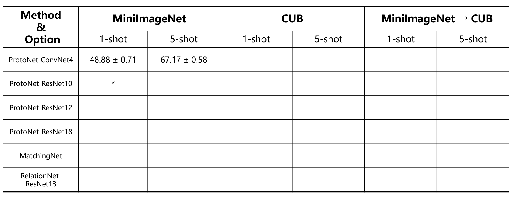

# Few Shot Learning for image classification

## Reference 
+ [GitHub: CloserLookFewShot](https://github.com/wyharveychen/CloserLookFewShot)
+ [GitHub: LearningToCompare_FSL](https://github.com/floodsung/LearningToCompare_FSL)
+ [GitHub: prototypical-network-pytorch](https://github.com/cyvius96/prototypical-network-pytorch)

## Result 
specification: train/val/test’s shot-way-query is the same setting shot-(way)5-(query)15

## Usage

<code>
	python main.py --model protonet --encoder resnet10 --continue_train --n_way 5 --n_shot 5 --n_query 15 --batch 100 --epochs 600 --lr 0.001 --optimizer Adam --lr_scheduler Step --decay_step 60 --gamma 0.5
</code> 
